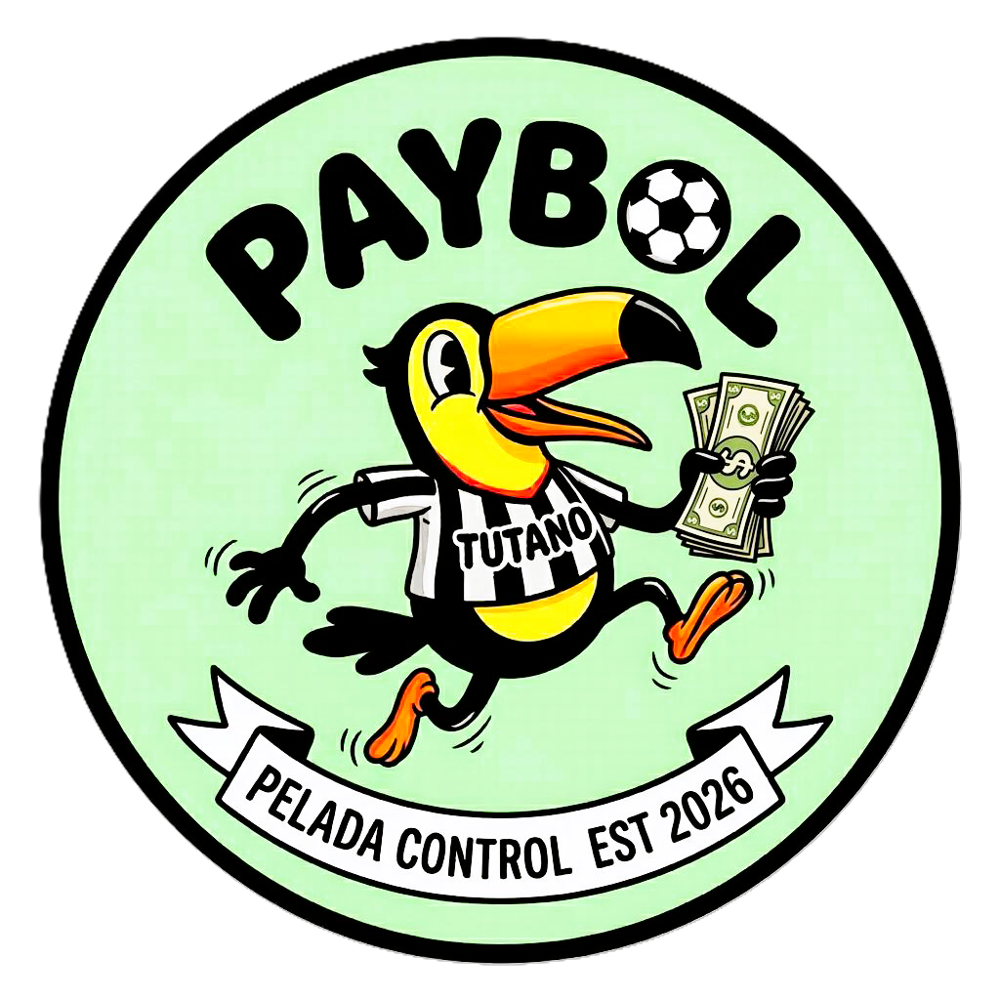

<div align="center">
  

  # Paybol

  Sistema web para gerenciar a lista de jogadores da pelada, com controle de pagamento<br>e dashboard de arrecadação — tudo persistido em banco de dados MySQL.

  [](https://adoptium.net/)
  [](https://jakarta.ee/)
  [](https://jakarta.ee/specifications/faces/)
  [](https://www.primefaces.org/)
  [](https://hibernate.org/)
  [](https://www.mysql.com/)
  [](https://maven.apache.org/)
  [](https://tomcat.apache.org/)

</div>

---

## Visão Geral

O **Paybol** é uma aplicação web CRUD desenvolvida com **Jakarta EE** para substituir as listas desorganizadas de grupos de WhatsApp por uma interface web limpa e funcional. Ele permite cadastrar jogadores, controlar quem já pagou e acompanhar o valor arrecadado em tempo real.

A aplicação possui três pilares:

1. **Lista de Jogadores** — Tabela interativa com cadastro, edição, exclusão e ordenação por nome, valor e status de pagamento.

2. **Controle de Pagamento** — Status visual (PAGO / PENDENTE) alternável com um clique, usando badges coloridos para identificação rápida.

3. **Dashboard de Resumo** — Cards em tempo real com total de jogadores, pagos, pendentes e valor arrecadado (R$).

---

## Funcionalidades

| Funcionalidade | Descrição |
|---|---|
| **Cadastrar jogador** | Nome, telefone/WhatsApp, valor e status de pagamento |
| **Listar jogadores** | Tabela PrimeFaces com ordenação por colunas |
| **Editar jogador** | Atualizar qualquer campo de um jogador existente |
| **Excluir jogador** | Remoção com confirmação de segurança |
| **Alternar pagamento** | Clique no badge para trocar PAGO ↔ PENDENTE |
| **Dashboard** | Total de jogadores, pagos, pendentes e R$ arrecadado |

---

## Tech Stack

| Camada | Tecnologia | Função |
|---|---|---|
| **Plataforma** | Jakarta EE 10 | Base da aplicação web empresarial |
| **Frontend** | JSF 4.0 + PrimeFaces 14 | Interface web com componentes ricos |
| **Controller** | CDI (Weld 5.1) | Injeção de dependência e managed beans |
| **ORM** | Hibernate 6.4 | Mapeamento objeto-relacional |
| **Persistência** | JPA 3.1 | API padrão de acesso a dados |
| **Banco de dados** | MySQL 8.0 | Armazenamento relacional |
| **Servidor** | Apache Tomcat 10.1 | Container de servlets Jakarta |
| **Build** | Apache Maven 3.9 | Gerenciamento de dependências |
| **Runtime** | JDK 17 (Temurin) | Ambiente de execução Java |

---

## Estrutura do Projeto

```
├── pom.xml
├── docs/
│   ├── trabalho-escrito.md
│   └── funcionalidades.md
└── src/main/
    ├── java/com/paybol/
    │   ├── model/
    │   │   ├── Jogador.java
    │   │   └── StatusPagamento.java
    │   ├── dao/
    │   │   └── JogadorDAO.java
    │   ├── bean/
    │   │   └── JogadorBean.java
    │   └── util/
    │       └── JPAUtil.java
    ├── resources/META-INF/
    │   └── persistence.xml
    └── webapp/
        ├── index.xhtml
        ├── cadastrar.xhtml
        ├── editar.xhtml
        ├── resources/
        │   ├── css/style.css
        │   └── images/paybol.PNG
        └── WEB-INF/
            ├── web.xml
            ├── beans.xml
            └── faces-config.xml
```

---

## Pré-requisitos

- [JDK 17](https://adoptium.net/) (Eclipse Temurin)
- [Apache Maven 3.9+](https://maven.apache.org/download.cgi)
- [MySQL Server 8.x](https://dev.mysql.com/downloads/installer/)
- [Apache Tomcat 10.1](https://tomcat.apache.org/download-10.cgi)

---

## Getting Started

### 1. Criar o banco de dados

```sql
CREATE DATABASE paybol_db;
```

### 2. Configurar conexão

Edite `src/main/resources/META-INF/persistence.xml` se necessário:

```xml
<property name="jakarta.persistence.jdbc.url"
          value="jdbc:mysql://localhost:3306/paybol_db"/>
<property name="jakarta.persistence.jdbc.user" value="root"/>
<property name="jakarta.persistence.jdbc.password" value="root"/>
```

### 3. Build e Deploy

```bash
mvn clean package
copy target\paybol.war %CATALINA_HOME%\webapps\
%CATALINA_HOME%\bin\startup.bat
```

### 4. Acessar

```
http://localhost:8080/paybol/
```

> [!NOTE]
> O Hibernate cria a tabela `jogadores` automaticamente na primeira execução.

---

## Arquitetura

```
┌──────────┐    ┌──────────┐    ┌───────────────┐    ┌───────────┐    ┌─────┐    ┌───────────┐    ┌───────┐
│ Browser  │ →  │ Tomcat   │ →  │ JSF/PrimeFaces│ →  │ CDI Bean  │ →  │ DAO │ →  │ Hibernate │ →  │ MySQL │
│  (View)  │    │ (Server) │    │  (Facelets)   │    │(Controller│    │(CRUD│    │   (ORM)   │    │ (DB)  │
└──────────┘    └──────────┘    └───────────────┘    └───────────┘    └─────┘    └───────────┘    └───────┘
```
